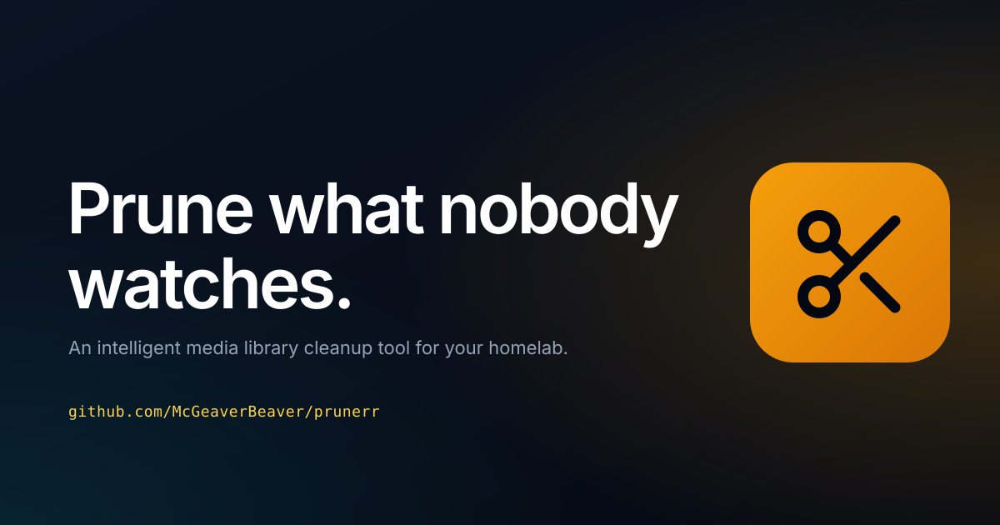

<p align="center">
  
</p>

<p align="center">
  <strong>Intelligent media library cleanup for Plex, Sonarr, and Radarr</strong>
</p>

<p align="center">
  <a href="https://github.com/McGeaverBeaver/prunerr/pkgs/container/prunerr"></a>
  
  <a href="https://github.com/McGeaverBeaver/prunerr/actions/workflows/docker-publish.yml"></a>
</p>

<p align="center">
  <a href="https://github.com/helliott20/prunerr/wiki">Wiki</a> &bull;
  <a href="https://github.com/helliott20/prunerr/wiki/Installation">Install</a> &bull;
  <a href="https://github.com/helliott20/prunerr/wiki/API-Reference">API</a> &bull;
</p>

---

If you run a media server, you know the pain. Your library keeps growing, nobody watches half of it, and you're constantly running out of disk space. Prunerr sits between your media server and your *arr apps and figures out what's worth keeping.

Works with **Plex**, **Jellyfin** and **Emby**.

You set up rules like "delete movies nobody's watched in 6 months that are over 20GB" and Prunerr handles the rest. Everything goes through a deletion queue first, so nothing gets removed without you knowing about it.

<p align="center">
  <a href="https://prunerr.media/assets/prunerr-brag.mp4">
    
  </a>
  <br>
  <sub>▶ 20-second overview: a full disk, a rule in plain English, a queue with a grace period, and the space coming back.</sub>
</p>

## Features

- **Unmanaged folders**: list folders Sonarr/Radarr don't own, import them into the right app or clean them up (docs/folders.md)

- **Rules Engine** &mdash; 28 condition fields across quality, ratings, watch history, collections, and metadata. Three ways to build rules: templates, natural language, or a full nested condition editor with live preview. [More &rarr;](https://github.com/helliott20/prunerr/wiki/Rules-Engine)

- **Collections** &mdash; Syncs movie collections from Radarr. Protect entire collections to prevent cleanup, or queue them for bulk deletion. [More &rarr;](https://github.com/helliott20/prunerr/wiki/Collections)

- **Smart Deletion** &mdash; Grace periods, four deletion actions (unmonitor, delete files, full removal, etc.), Seerr request resets, and a review queue. Nothing gets deleted without your say-so. [More &rarr;](https://github.com/helliott20/prunerr/wiki/Deletion-Management)

- **Archive** &mdash; Before a queued title is deleted, Prunerr asks Radarr/Sonarr whether it could be downloaded again as good as the copy you have. Titles that could not be (no release, a downgrade, a few seeders) are held for a decision or archived automatically: protected for good, still playable, never scanned again. [More &rarr;](docs/archive.md)

- **Dashboard** &mdash; Library stats, storage trends, service health monitoring, upcoming deletions, and recommendations at a glance.

- **Insights** &mdash; One page on how the whole setup is doing: every problem across Prunerr, Sonarr, Radarr and the media server with a next step, the library's resolution and codec mix, what people actually watch, and where playback transcodes or gets abandoned. [More &rarr;](docs/insights.md)

- **Plex, Jellyfin or Emby** &mdash; Pick your media server in Settings, or set `MEDIA_SERVER_TYPE`. Rules, scanning and deletion work the same whichever you use. [More &rarr;](https://github.com/helliott20/prunerr/wiki/Installation)

- **Per-User Watch History** &mdash; Read directly from your media server, or integrate Tautulli or Tracearr (both Plex-only) to track who watched what. Build rules around specific users' watching habits.

- **Watch State** &mdash; Every sync works out who is in progress on a title, who finished it, and how much of a show has been seen, so rules can delete finished shows and never touch one someone is watching (`in_progress`, `fully_watched`, `watch_completion`). [More &rarr;](docs/watch-state.md)

- **API** &mdash; Full REST API with key authentication for scripts, automation, and mobile apps like nzb360. [More &rarr;](https://github.com/helliott20/prunerr/wiki/API-Reference)

- **AI assistant (MCP)** &mdash; A built-in [Model Context Protocol](https://modelcontextprotocol.io) server at `/mcp`. Let Claude, Cursor or any MCP client search the library, review the queue, preview and build rules, and queue cleanups with you &mdash; through the same grace-period queue, with protected items off limits and immediate deletion opt-in. [More &rarr;](docs/mcp.md)

- **Login & roles** &mdash; Optional single sign-on through Authentik or any OpenID Connect provider, with admin / operator / viewer roles mapped from your groups, plus an optional local account. All configured by environment variables. [More &rarr;](docs/authentication.md)

## Quick Start

```bash
docker run -d \
  --name prunerr \
  -p 3000:3000 \
  -v /path/to/data:/app/data \
  -e PLEX_URL=http://your-plex-server:32400 \
  -e PLEX_TOKEN=your-plex-token \
  -e SONARR_URL=http://your-sonarr:8989 \
  -e SONARR_API_KEY=your-sonarr-api-key \
  -e RADARR_URL=http://your-radarr:7878 \
  -e RADARR_API_KEY=your-radarr-api-key \
  ghcr.io/mcgeaverbeaver/prunerr:main
```

For **Jellyfin** or **Emby**, swap the two Plex variables for:

```bash
  -e MEDIA_SERVER_TYPE=jellyfin \
  -e JELLYFIN_URL=http://your-server:8096 \
  -e JELLYFIN_API_KEY=your-api-key \
```

Use `MEDIA_SERVER_TYPE=emby` for Emby; both share the `JELLYFIN_*` variables. On Jellyfin, install the
**Playback Reporting** plugin for full watch history — without it Jellyfin only keeps the most recent play
per item, so repeat views collapse into one.

The image is published to the GitHub Container Registry as
[`ghcr.io/mcgeaverbeaver/prunerr`](https://github.com/McGeaverBeaver/prunerr/pkgs/container/prunerr).
`:main` follows the main branch (with a pinned `:main-<sha>` per build), `:beta`
follows the `beta` branch, and version tags publish `:<version>` and `:latest`.

| Platform | How |
|----------|-----|
| **Docker Compose** | [`docker-compose.yml`](docker-compose.yml) in this repo |
| **Unraid** | Add [`my-prunerr.xml`](my-prunerr.xml) as a template, or paste its raw URL into *Add Container* &rarr; *Template* |

See the [Installation guide](https://github.com/helliott20/prunerr/wiki/Installation) for full details.

### Beta channel

`ghcr.io/mcgeaverbeaver/prunerr:beta` is rebuilt from the `beta` branch as changes land, if
you want to try features before they are released. On Unraid, pick **Beta** from
the template's branch list; elsewhere, point the image at `:beta` instead of
`:main`. Back up your database first — beta builds can include schema
migrations, and downgrading is not supported.

## Integrations

| Service | Purpose | Required |
|---------|---------|----------|
| **Plex** / **Jellyfin** / **Emby** | Media server &mdash; library data, watch status | One required |
| **Sonarr** | TV show management | Recommended |
| **Radarr** | Movie management, collections | Recommended |
| **Tautulli** / **Tracearr** | Per-user watch history (Plex only) | Optional |
| **Seerr** | Request management | Optional |
| **Unraid** | Server monitoring | Optional |
| **Discord** | Notifications | Optional |

## Mobile

Prunerr works as a custom web app in [nzb360](https://nzb360.com/) on Android, or in any mobile browser. The UI is fully responsive. See the [Mobile Access guide](https://github.com/helliott20/prunerr/wiki/Mobile-Access).

## Documentation

Full docs are in the **[Wiki](https://github.com/helliott20/prunerr/wiki)**:

- [Installation](https://github.com/helliott20/prunerr/wiki/Installation) &mdash; Docker, Compose, Unraid
- [Configuration](https://github.com/helliott20/prunerr/wiki/Configuration) &mdash; Environment variables and service connections
- [Rules Engine](https://github.com/helliott20/prunerr/wiki/Rules-Engine) &mdash; Building and managing rules
- [Collections](https://github.com/helliott20/prunerr/wiki/Collections) &mdash; Protection and bulk actions
- [Deletion Management](https://github.com/helliott20/prunerr/wiki/Deletion-Management) &mdash; Queue, grace periods, actions
- [API Reference](https://github.com/helliott20/prunerr/wiki/API-Reference) &mdash; Endpoints and authentication
- [Login & access](docs/authentication.md) &mdash; Single sign-on (Authentik/OIDC), roles, local account
- [AI assistant (MCP)](docs/mcp.md) &mdash; Connect Claude, Cursor and other MCP clients
- [Insights](docs/insights.md) &mdash; Stack health, library quality, watch patterns, playback friction
- [Watch state](docs/watch-state.md) &mdash; In-progress and finished detection per viewer, and the rule fields built on it
- [Archive](docs/archive.md) &mdash; Re-acquisition checks before deletion, holds and archived titles
- [Troubleshooting](https://github.com/helliott20/prunerr/wiki/Troubleshooting) &mdash; Common issues

## Privacy

Prunerr talks only to the services you configure (your media server, Sonarr,
Radarr and the other integrations in Settings). There is no telemetry, no
update check, no remote feed and no third-party fonts or scripts: nothing is
sent anywhere, and nothing asks you whether it may.

## Support

- **GitHub:** [McGeaverBeaver/prunerr](https://github.com/McGeaverBeaver/prunerr)
- **Container image:** [ghcr.io/mcgeaverbeaver/prunerr](https://github.com/McGeaverBeaver/prunerr/pkgs/container/prunerr)
- **Upstream project:** [helliott20/prunerr](https://github.com/helliott20/prunerr), whose wiki the links above point at

## License

MIT License. See [LICENSE](LICENSE).
